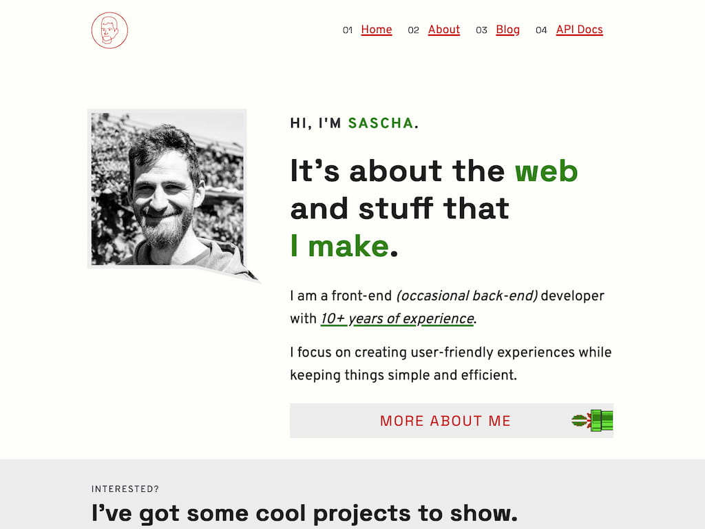

<div align="center">
  
  <br />
  <h1><a href="https://sascha.work" hreflang="en" target="_blank">https://sascha.work</a></h1>
  <strong>The git repository of my personal website. 🌐</strong>
  <br />
  <br />
  <br />
</div>

<div align="center">
  
  <br />
  <br />
</div>

## Technology

The tech stack used for this website consists mainly of a static HTML output generated by [Eleventy](https://11ty.dev), as well as a collection of static JSON files as API endpoints. Furthermore, some [serverless functions](./api/) written in Go provide some dynamic data sources used by this website.

## Prerequisites

The currently required runtimes are listed in the [.tool-versions](.tool-versions) file. Runtime version managers like [Mise](https://mise.jdx.dev) or [asdf](https://asdf-vm.com) should pick up this file automatically.

Additionally, a [Netlify](https://netlify.com) account is suggested, if remote deployment is desired.

> ℹ️ **Disclaimer**: I am **not** affiliated with Netlify in any way.

### Suggested Environment Variables

If deploying via Netlify, the following environment variables, will be provided by `netlify deploy --build` automatically:

- `CONTEXT`: set to `production`, if an optimized production build is desired.
- `URL` (for `CONTEXT=production`), or `DEPLOY_URL`: set the correct origin, where the website will be available later on (for canonical URLs).

The following environment variable has to be set manually (if a reference to the current commit is desired on the website):

- `SHORT_SHA`: equal to the output of `git rev-parse --short HEAD`.

If re-using the included [GitHub Actions](.github/workflows/) is desired, the following [Netlify](https://netlify.com)-specific environment variables are required:

- `NETLIFY_AUTH_TOKEN`: the auth token needed to authenticate the Netlify user.
- `NETLIFY_SITE_ID`: the Netlify site to deploy to.

## Setup

1. Clone the repository

   ```bash
   git clone https://github.com/saschazar21/sascha.work
   ```

1. Change into the directory and install required runtimes

   ```bash
   mise install  # if using mise
   ```

   ```bash
   asdf install  # if using asdf
   ```

1. Install dependencies

   ```bash
   pnpm install
   ```

1. Build project

   ```bash
   make
   ```

   The output will be available in the `public`-, as well as in the `functions`-directory.

## License

Licensed under the MIT license.

Copyright ©️ 2025 [Sascha Zarhuber](https://sascha.work)
